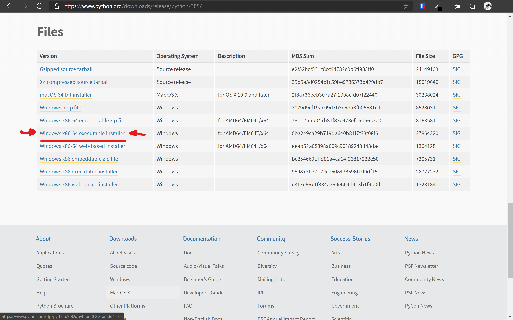
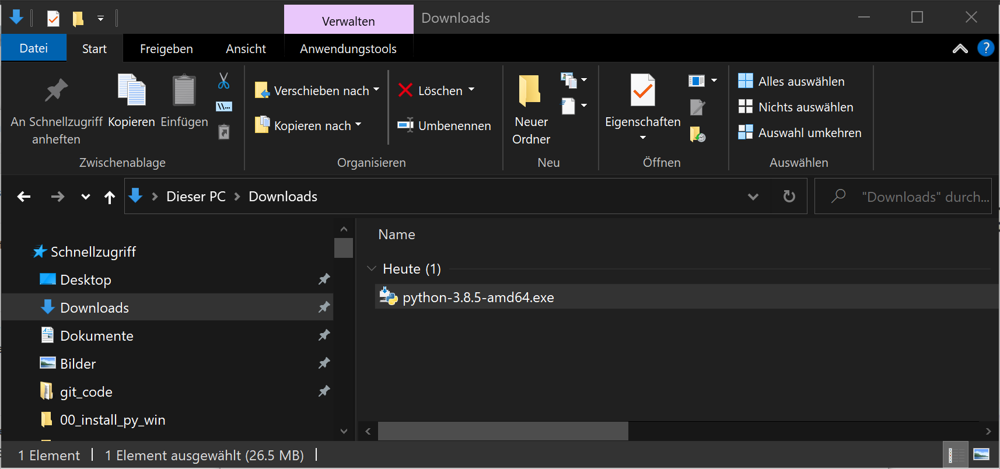
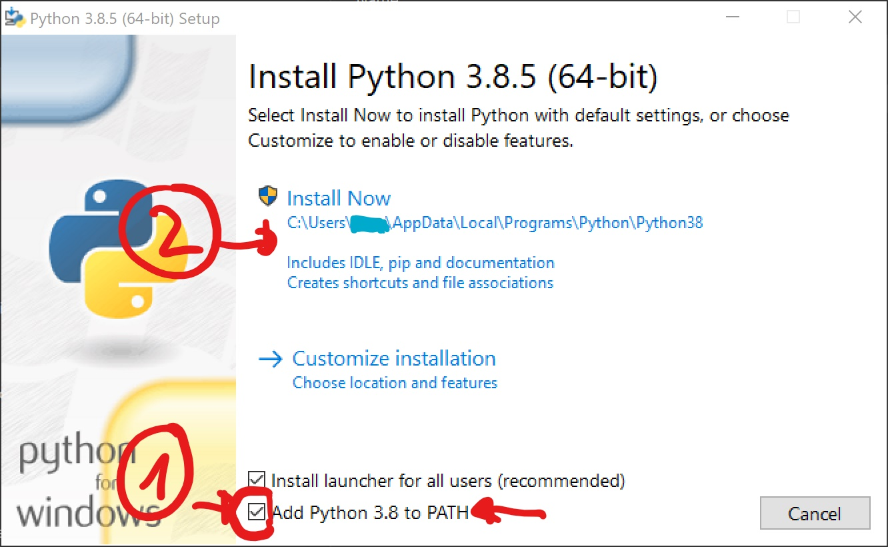
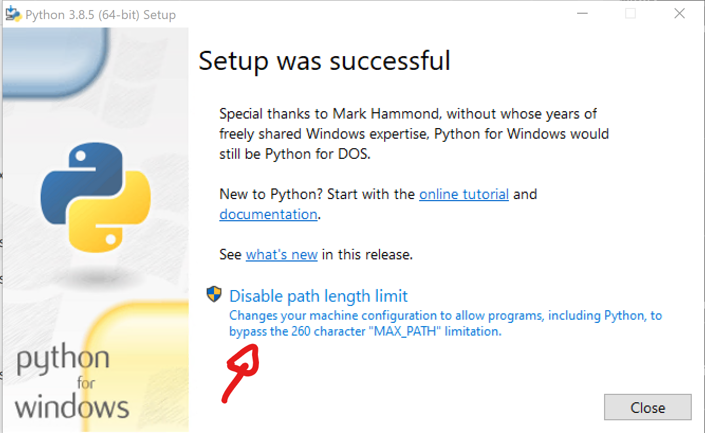
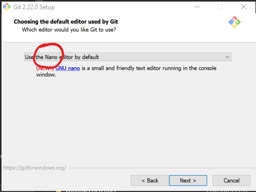
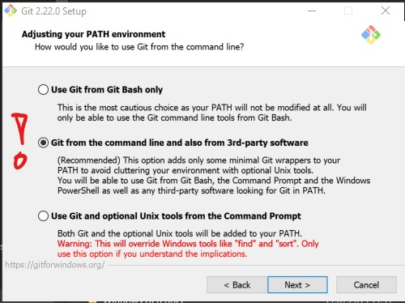

# ISPW Programming Basics VS Code Extension Pack


Install the extension from the [Marketplace](https://marketplace.visualstudio.com/items?itemName=lebalz.ispw-programming-basics).

This extension pack adds the following vs code plugins:

- [Git2go](https://marketplace.visualstudio.com/items?itemName=lebalz.git2go)
- [Python2go](https://marketplace.visualstudio.com/items?itemName=lebalz.python2go)
- [Python](https://marketplace.visualstudio.com/items?itemName=ms-python.python)
- [Markdown Preview Github Styles](https://marketplace.visualstudio.com/items?itemName=bierner.markdown-preview-github-styles)
- [Git Graph](https://marketplace.visualstudio.com/items?itemName=mhutchie.git-graph)
- [Python Test Adapter](https://marketplace.visualstudio.com/items?itemName=LittleFoxTeam.vscode-python-test-adapter)
- [Test Explorer](https://marketplace.visualstudio.com/items?itemName=hbenl.vscode-test-explorer)
- [Mardkdown Pdf](https://marketplace.visualstudio.com/items?itemName=yzane.markdown-pdf)
- [Markdown All in One](https://marketplace.visualstudio.com/items?itemName=yzhang.markdown-all-in-one)
- [Bracket Pair Colorzier 2](https://marketplace.visualstudio.com/items?itemName=CoenraadS.bracket-pair-colorizer-2)
- [CSV Viewer](https://marketplace.visualstudio.com/items?itemName=GrapeCity.gc-excelviewer)
- [Gitlens](https://marketplace.visualstudio.com/items?itemName=eamodio.gitlens)
- [Path Intellisense](https://marketplace.visualstudio.com/items?itemName=christian-kohler.path-intellisense)
- [Vscode Intellicode](https://marketplace.visualstudio.com/items?itemName=VisualStudioExptTeam.vscodeintellicode)


## Installation

- [Windows](#windows)
- [Apple OSX](#apple-osx)

### Windows
#### 1. Install Python
1. Download a current Version of [python.org](https://python.org/downloads/) (get the `Windows x86-64 executable installer`).
    
2. Install it by navigating to `Downloads` and double klicking the downloaded `.exe` File.
    
3. Make shure you **checked** the box **Add Python 3.8 to PATH**
4. Click `Install Now`
    
5. Disable the pathelength limitation of windows (if not already done)
    

#### 2. Install Git

Download Git from [git-scm.com](https://git-scm.com/downloads) and install it. The default options are a good startpoint, but make sure to select the following options on these 3 install screens:




#### 3. In VS Code

Restart VS Code and follow the hints given by the notifications. Click `Install` when you are prompted to install Python. 

### Apple OSX

#### 1. Install Homebrew
Open a Terminal (search for `Terminal` in the Spotlight: `⌘ + Leertaste`) and execute the following command. You may be prompted for your computer password.

```sh
xcode-select --install
/bin/bash -c "$(curl -fsSL https://raw.githubusercontent.com/Homebrew/install/master/install.sh)"
```
#### 2. In VS Code

Restart VS Code and follow the hints given by the notifications. Click `Install` when you are prompted to install Python. 
